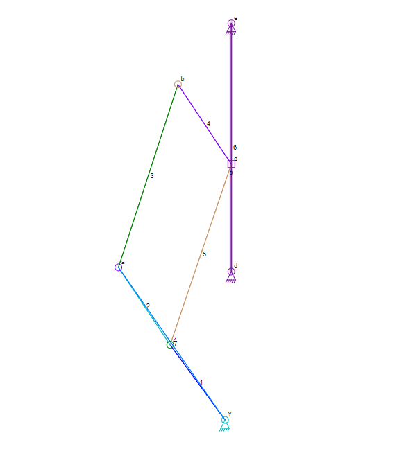
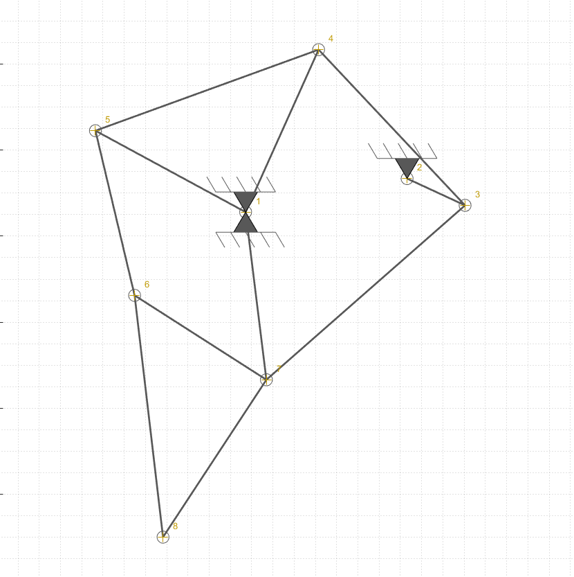
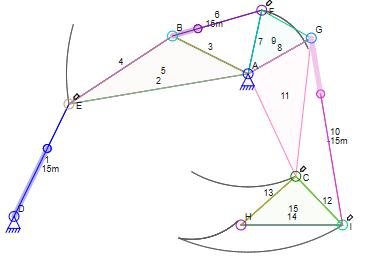

# 作业1
## 任选一个本章中涉及到的例子，尝试使用Linkage工具包绘制其机械简图，分析关键构件的运动轨迹及该机构自由度

选取窗户合叶模型，Linkage工具包绘制机械简图如下，机构共3个自由度

  

## 查阅资料，使用DAS2D/3D绘制Jansen连杆机构的运动简图（请自行设定杆件尺寸），分析杆件及运动副数量、关键构件的运动轨迹及该机构自由度

构建运动简图如下，共11个杆件，16个运动副，1个自由度

  

## 查阅资料，使用DAS2D/Linkage绘制下述挖掘机机构的运动简图（请自行设定杆件尺寸），分析杆件及运动副数量、关键构件的运动轨迹及该机构自由度

构建运动简图如下，共7个杆件，9个运动副，3个自由度

  

