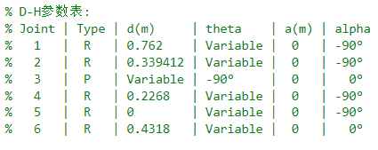
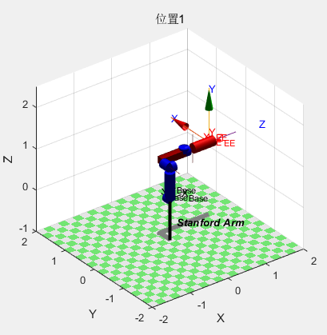
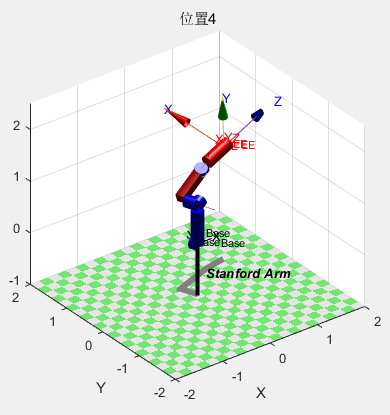
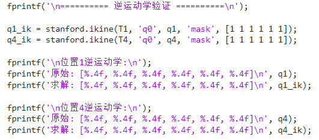
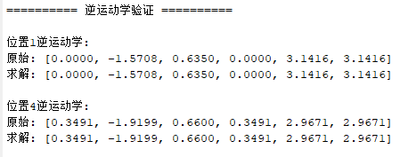
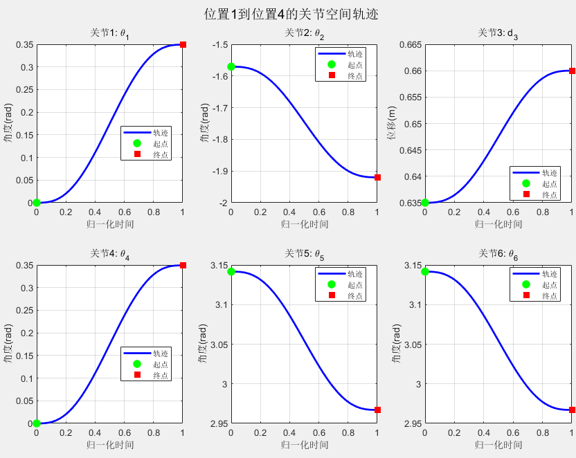
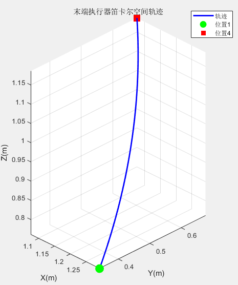
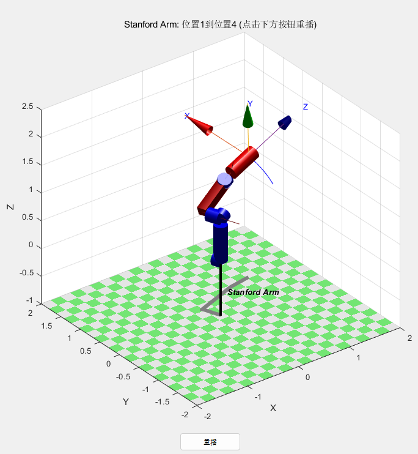
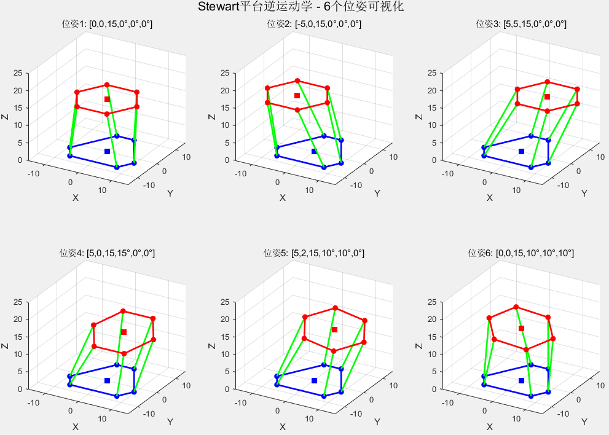
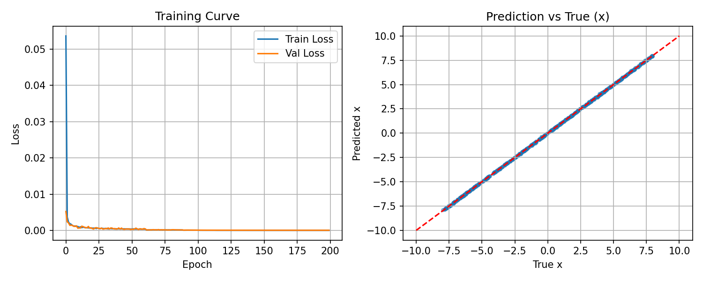

# 作业2
## 题目1
1. 查阅资料，根据D-H法则建立Stanford Arm坐标系；
2. 使用Matlab/Python Robotics ToolBox (Peter Corke版本)建立该机器人模型，分析在以下关节输入参数下机器人的位姿并在Matlab中可视化呈现（展示机器人构型、位姿、基座标系和末端执行器坐标系）；
3. 将位姿结果逆向输入，求解关节输入参数; 
4. 假设机器人由1位置运动到4位置，绘制参数空间运动轨迹。

### 1、查阅资料，根据D-H法则建立Stanford Arm坐标系

建立D-H坐标系如下

  

### 2、使用Matlab/Python Robotics ToolBox (Peter Corke版本)建立该机器人模型，分析在以下关节输入参数下机器人的位姿并在Matlab中可视化呈现（展示机器人构型、位姿、基座标系和末端执行器坐标系）

建立机器人模型和位姿可视化如下图

  
  

### 3、将位姿结果逆向输入，求解关节输入参数
逆向输入，求解关节输入参数如下

  
  

### 4、假设机器人由1位置运动到4位置，绘制参数空间运动轨迹
绘制参数空间运动轨迹如下

  
  

  

## 题目2
1. 查阅资料，根据如下尺寸信息及Stewart平台运动特点建立逆向运动学模型，求解以下6个个不同位姿机器人关节参数，尝试通过圆及直线等图形化表达绘制机器人对应的形态；
2. 尝试根据逆运动学输入输出训练神经网络，通过数据驱动的方法求解正运动学。

### 1、查阅资料，根据如下尺寸信息及Stewart平台运动特点建立逆向运动学模型，求解以下6个个不同位姿机器人关节参数，尝试通过圆及直线等图形化表达绘制机器人对应的形态

建立机器人模型和位姿可视化如下图

  

### 2、尝试根据逆运动学输入输出训练神经网络，通过数据驱动的方法求解正运动学
代码如 **generate_training_data.m** 和 **forward_kinematics_nn.py**。随机生成 50000 个位姿样例，作为数据集，训练得到 loss 收敛曲线和正运动学验证集准确对比如下

  

