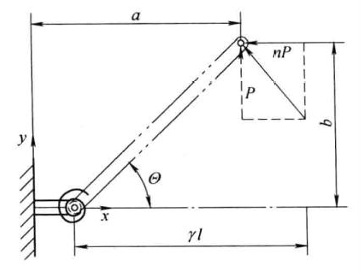
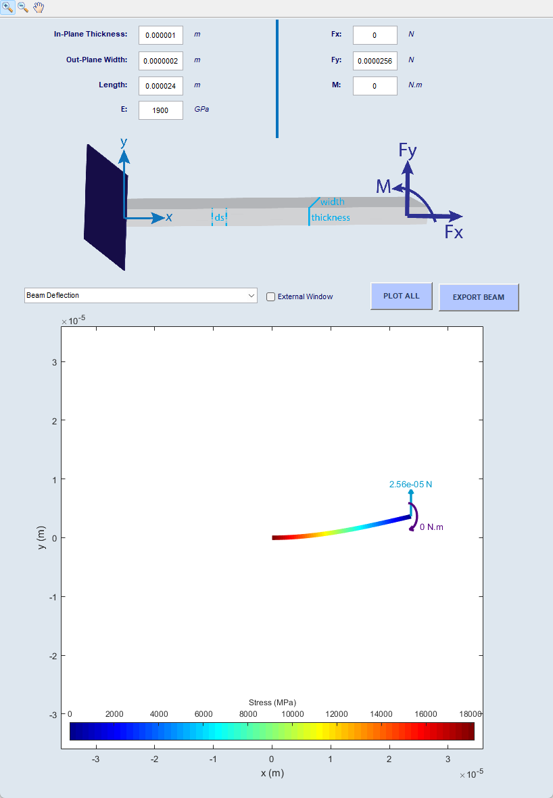
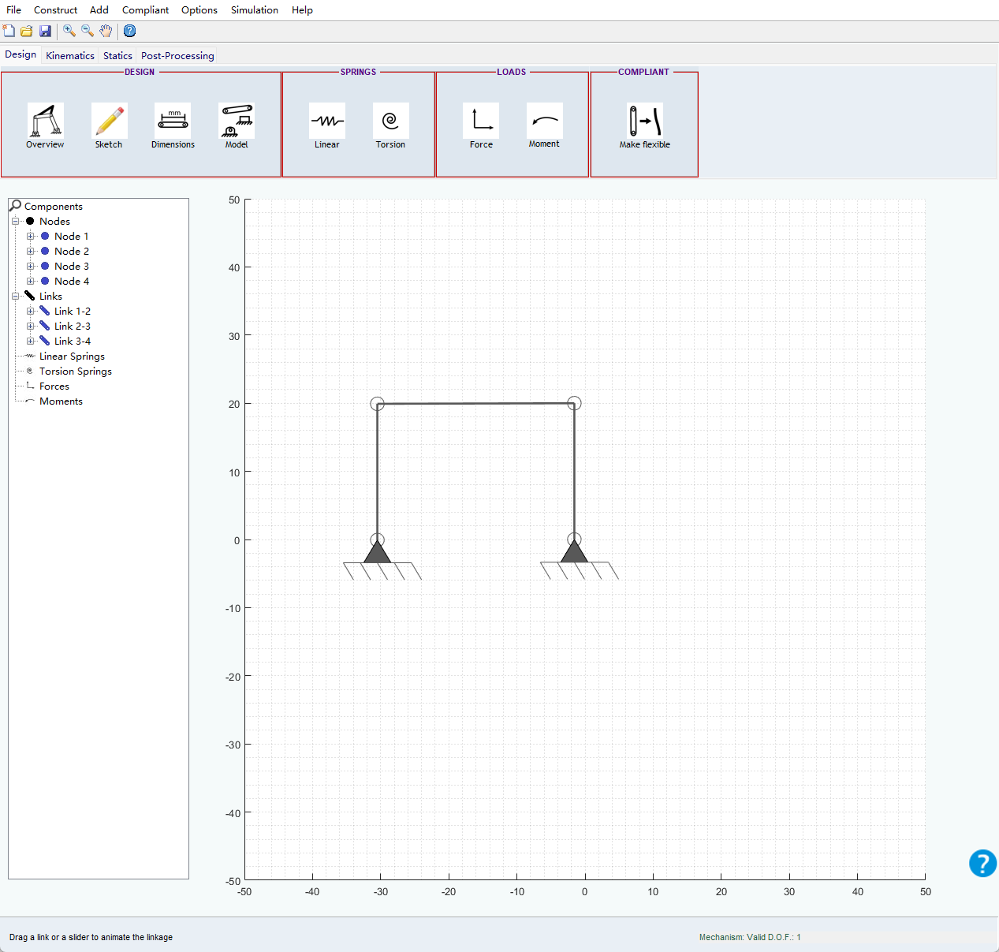
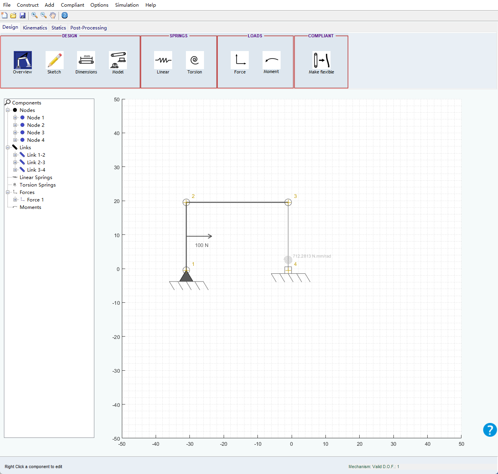
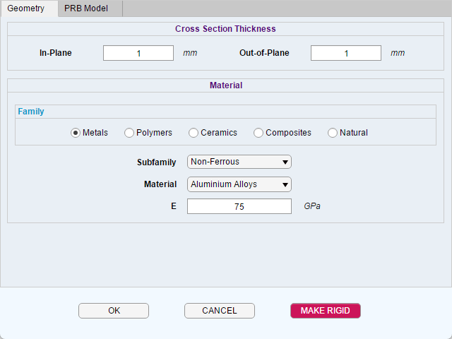
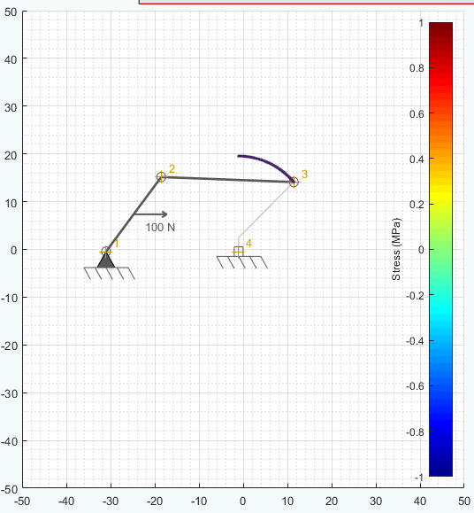
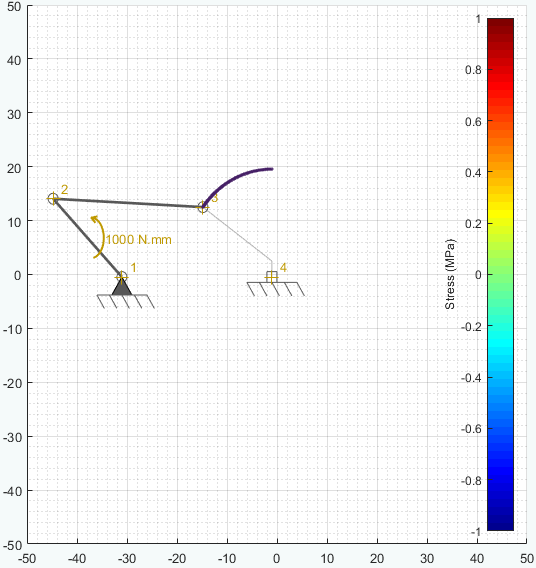
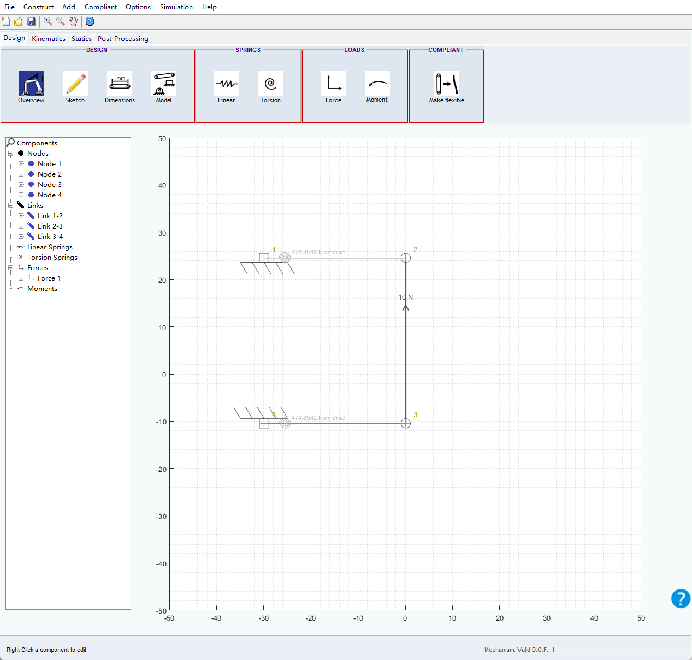
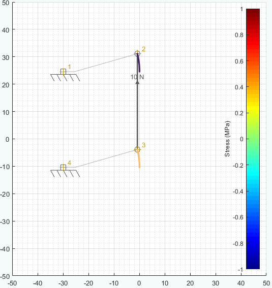

# 作业3

## 题目1

材料为多晶硅的微型柔性梁自由端受到垂直力的作用，其尺寸为 $L = 24\ \mu\text{m}$，$b = 1\ \mu\text{m}$，$h = 0.2\ \mu\text{m}$，弹性模量为 $E = 1.9 \times 10^{11}\ \text{N/m}^2$。

**问题：**

1. 应用小变形理论计算产生 $2\ \mu\text{m}$ 垂直变形时的末端受力和最大应力；
2. 绘制其伪刚体模型，计算产生 $8\ \mu\text{m}$ 垂直变形时的末端受力和末端水平坐标；
3. 学习使用DAS2D伪刚体模型模块，模拟分析（2）中的情况。

### 1、应用小变形理论计算产生 $2\ \mu\text{m}$ 垂直变形时的末端受力和最大应力

- 梁长度：$L = 24\ \mu\text{m} = 24 \times 10^{-6}\ \text{m}$
- 梁宽度：$b = 1\ \mu\text{m} = 1 \times 10^{-6}\ \text{m}$
- 梁厚度：$h = 0.2\ \mu\text{m} = 0.2 \times 10^{-6}\ \text{m}$
- 弹性模量：$E = 1.9 \times 10^{11}\ \text{N/m}^2$
- 垂直变形：$\delta = 2\ \mu\text{m} = 2 \times 10^{-6}\ \text{m}$

矩形截面的惯性矩：

$$I = \frac{bh^3}{12} = \frac{1 \times 10^{-6} \times (0.2 \times 10^{-6})^3}{12} = 6.67 \times 10^{-28}\ \text{m}^4$$

末端力 $F$：

$$F = \frac{3EI\delta}{L^3} = \frac{3 \times 1.9 \times 10^{11} \times 6.67 \times 10^{-28} \times 2 \times 10^{-6}}{(24 \times 10^{-6})^3}$$

$$F = 5.50 \times 10^{-8}\ \text{N} = 55.0\ \text{nN}$$

悬臂梁在固定端处弯矩最大：

$$M_{max} = FL = 5.50 \times 10^{-8} \times 24 \times 10^{-6} = 1.32 \times 10^{-12}\ \text{Nm}$$

最大弯曲应力：

$$\sigma_{max} = \frac{M_{max} \cdot (h/2)}{I} = \frac{1.32 \times 10^{-12} \times 0.1 \times 10^{-6}}{6.67 \times 10^{-28}} = 1.98 \times 10^{8}\ \text{Pa} = 198\ \text{MPa}$$

### 2、绘制其伪刚体模型，计算产生 $8\ \mu\text{m}$ 垂直变形时的末端受力和末端水平坐标

对于末端受垂直力的悬臂梁：

- 特征半径系数：$\gamma = 0.85$
- 刚度系数：$K = 2.25 \frac{EI}{l}$

伪刚体等效长度：

$$l = \gamma L = 0.85 \times 24 = 20.4\ \mu\text{m}$$

扭转弹簧刚度：

$$K = 2.25 \frac{EI}{L} = 1.19 \times 10^{-11}\ \text{Nm/rad}$$

对于 $b = 8\ \mu\text{m}$：

$$\Theta = \arcsin \frac{b}{0.85L} = 0.40\ \text{rad}$$

$$a = L [1-0.85(1-\cos\Theta)] = 22.38\mu\text{m}$$

$$F = \frac{K \cdot \Theta}{\gamma L \cos\Theta} = \frac{1.20 \times 10^{-11} \times 0.40}{0.85 \times 24 \times 10^{-6} \times 0.920} = 2.56 \times 10^{-7}N$$

绘制伪刚体模型如下图所示。

  

### 3、学习使用DAS2D伪刚体模型模块，模拟分析（2）中的情况
DAS2D模拟如下所示。

  

## 题目2

自选尺寸和材料属性，学习通过DAS2D模块分析带有柔顺构件的平行机构

1. 绘制平行四杆机构，在报告中标注相关材料参数选择；
2. 将其中一个连架杆变为柔顺杆，选定合适的伪刚体模型进行模拟；
3. 分析输入杆（1-2）受力/力矩和输出（点3）的位置变化关系；

### 1、绘制平行四杆机构，在报告中标注相关材料参数选择

平行四杆机构如图所示，材料选用铝合金。

  

### 2、将其中一个连架杆变为柔顺杆，选定合适的伪刚体模型进行模拟
3-4杆变为柔顺杆，选定伪刚体模型如图所示。

  
  

### 3、分析输入杆（1-2）受力/力矩和输出（点3）的位置变化关系

输入杆（1–2）所承受的力/力矩经由连杆（2–3）传递至点 3。点 3 的位移由两部分共同决定：一方面是输入杆驱动所引起的刚体运动，另一方面是 3–4 弹性杆在伪刚体模型下产生的弹性变形。随着输入载荷的增大，点 3 的位移显著增加；而在载荷相同的条件下，3–4 弹性杆的等效刚度越大，点 3 的位移越小。具体关系如下图所示。

  
  

## 题目3
1. 绘制平行四杆机构，在报告中标注相关材料参数选择；
2. 将其中两个连架杆变为柔顺杆形成柔性铰链，选定合适的伪刚体模型进行模拟；
3. 分析输入杆（2-3）受垂直方向力和输出（点2及点3）的位置变化关系；

### 1、绘制平行四杆机构，在报告中标注相关材料参数选择
材料选取铝合金，平行四杆机构如图所示。

  

### 2、将其中两个连架杆变为柔顺杆形成柔性铰链，选定合适的伪刚体模型进行模拟
伪刚体模型模型及参数

  
  

### 3、分析输入杆（2-3）受垂直方向力和输出（点2及点3）的位置变化关系
位置变化如图所示。

  

## 题目4

自定义连续体机构的尺寸及驱动杆件的初始长度，利用 Matlab / Python 完成建模。针对两根绳 / 丝 / 线驱动系统建立正向运动学模型，考虑 $l_1$ 及 $l_2$ 增减量相同时，分析该变化量与以下变量之间的关系：

- 弯折角度 $\theta$
- 末端坐标 $(x, y)$

